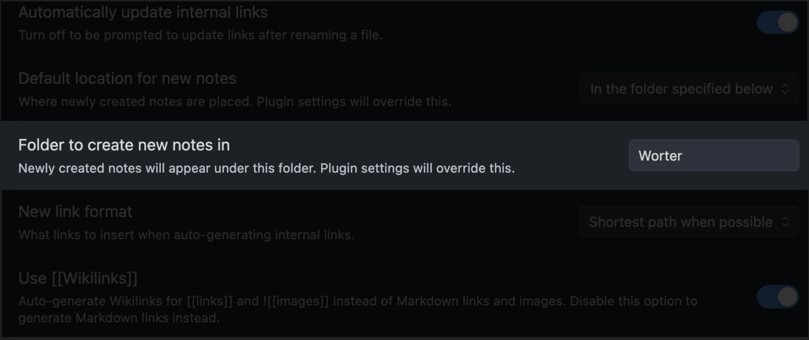

# Custom Dictionary Builder (Obsidian Plugin)

Open a file with German text.
For every unknown word, generate a structured vocabulary entry with context from the text.
Enjoy the web of your personal dictionary.

## Overview

This plugin helps you create and maintain a comprehensive German language learning system in Obsidian. It automatically generates structured entries for: Verbs, Nouns (with gender color-coding: 🔵 masculine, 🔴 feminine, 🟢 neuter), Adjectives, and other parts of speech.

Once any form of a word appears in your text:

It and all of its other forms will be linked to its infinitive form:

The infinitive form points to all forms of the word, its antonyms, and synonyms:

## Key Features

### 1. Structured Entry Templates
Each word type has a specialized template that includes:
- Pronunciation
- Conjugation/declension tables
- Synonyms and antonyms
- Translation
- Morphological breakdown
- Part of speech tagging

### 2. Automatic Backlink Management
The plugin automatically maintains bidirectional links between related words, helping you build a network of connected vocabulary:
- Links between base verbs and their prefixed forms
- Connections between synonyms and antonyms
- References between related grammatical forms

## Setup
1. The plugin will be creating a LOT of files (every konjugation of every word will live in it's own file). So it is hightly recommendend to make a special folder ("Worter") for all the new files to go to by default. 

All of the automatically created files go to Worter/{the_fiest_letter_of_the_word}/{word} bt default

2. Setup the hotkes for plugin's commands. The essential ones are:
- Get infinitive form and emoji for current word (Inf command)
- Generate an dictionary entrie for the word in the title of the file (Generate command)
- Add backlinks to the current file in all referenced files (Populate command)

## Usage

1. Go to any German text
2. Select any German word and enclose it in [[]]
3. Go to the [[selected_word]]
4. Invoke the Inf command
5. Go to the generated infinitive / normal form of the word
6. Invoke the Generate command
7. Invoke the Populate command
8. Add the context from your text to the emplty block at the start of the dictionary entrie 

## Network Use

This plugin utilizes network requests to communicate with the following remote services:

*   **Google Gemini API:** Used for translation, dictionary entry generation, and other language processing tasks.
*   **DeepSeek API:** Used as an alternative API provider for translation and language processing tasks.

These APIs require network access to function properly. The plugin sends text to these services for processing and receives the results back. Your API keys are stored securely within your Obsidian vault and are not shared with any third parties.

## API Keys

This plugin requires you to provide your own API keys for the Google Gemini API and/or the DeepSeek API. You can obtain these keys by creating accounts on the respective platforms.

## Disclaimer

This plugin is not affiliated with or endorsed by Google or DeepSeek. The use of the Google Gemini API and DeepSeek API is subject to their respective terms of service.

## License

This plugin is licensed under the MIT License. See the `LICENSE` file for the full license text.
