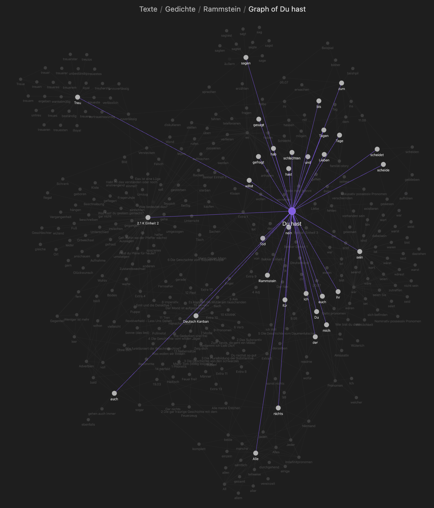
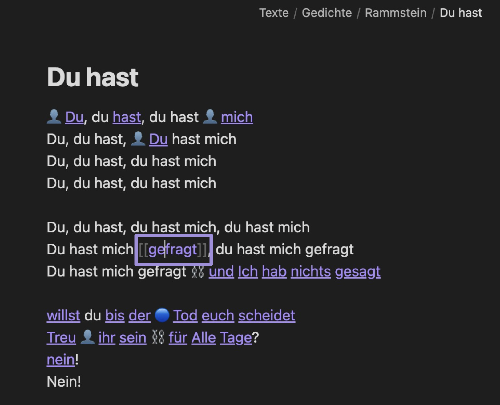
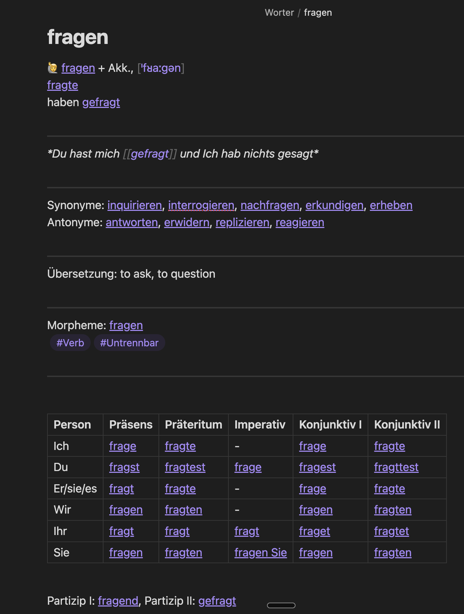

# Custom dictionary builder (Obsidin plugin)

Open the file with a german text.
For every unknown word in it, generate a structured vocabulary entry. Add to the entry context from the text.
Enjoy the web of your personal dictionary.

## Overview

This plugin helps you create and maintain a comprehensive German language learning system in Obsidian. It automatically generates structured entries for: Verbs, Nouns (with gender color-coding: 🔵 masculine, 🔴 feminine, 🟢 neuter), Adjectives, Other parts of speech

Once any form of a word is added to a dictionary, 

it and all of it's other forms will be linked to it's infinite form.

The infinite form points to all the forms of the word, it's antonyms and synonyms.

## Key Features

### 1. Structured Entry Templates
Each word type has a specialized template that includes:
- Pronunciation
- Conjugation/declension tables
- Synonyms and antonyms
- Translation
- Morphological breakdown
- Part of speech tagging

### 2. Automatic Backlink Management
The plugin automatically maintains bidirectional links between related words, helping you build a network of connected vocabulary:
- Links between base verbs and their prefixed forms
- Connections between synonyms and antonyms
- References between related grammatical forms

## Usage

1. Create a new note in your vault
2. Open the command palette (Cmd/Ctrl + P)
3. Choose the appropriate template for your word type
4. Fill in the basic information - the plugin will handle the formatting and linking
