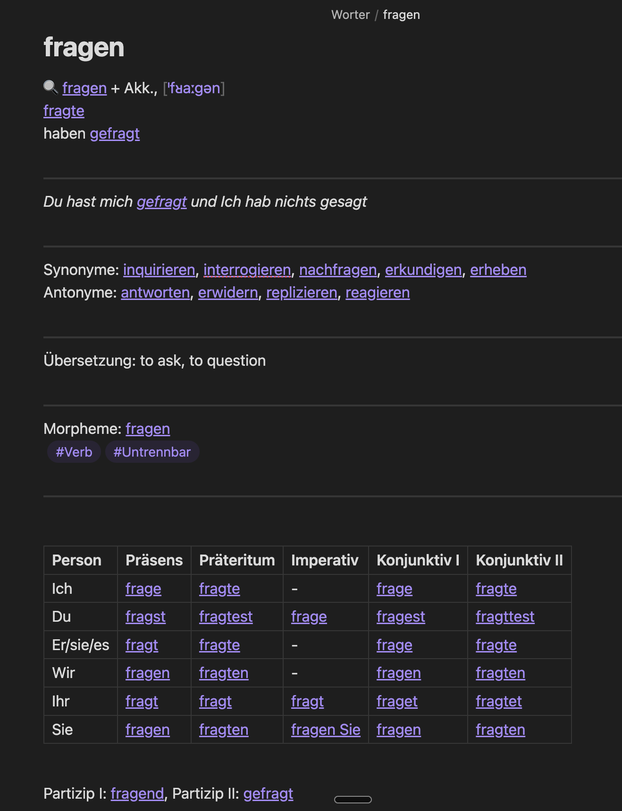
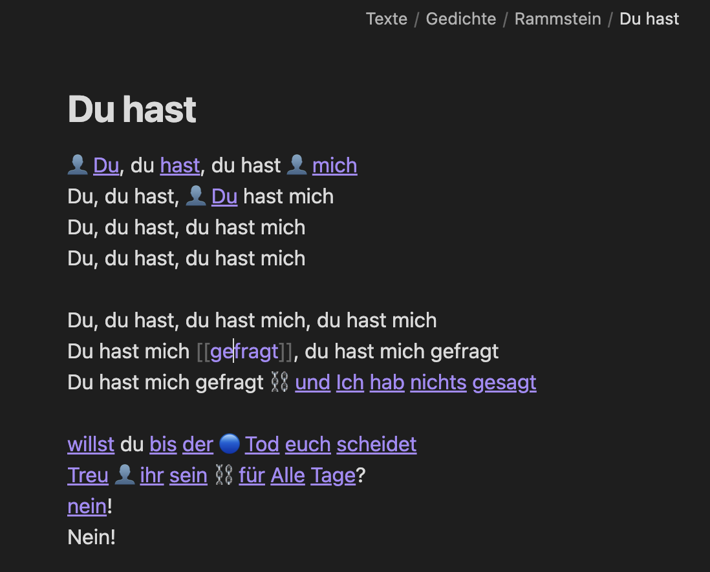

# Obsidian German Language Learning Plugin

An Obsidian plugin designed to enhance your German language learning experience by creating structured vocabulary entries with automatic backlinks. Perfect for building an interconnected German vocabulary and grammar knowledge base.

## Overview

This plugin helps you create and maintain a comprehensive German language learning system in Obsidian. It automatically generates structured entries for:
- Verbs (both separable and inseparable)
- Nouns (with gender color-coding: 🔵 masculine, 🔴 feminine, 🟢 neuter)
- Adjectives
- Other parts of speech

## Key Features

### 1. Structured Entry Templates
Each word type has a specialized template that includes:
- Pronunciation
- Conjugation/declension tables
- Synonyms and antonyms
- Translation
- Morphological breakdown
- Part of speech tagging

### 2. Automatic Backlink Management
The plugin automatically maintains bidirectional links between related words, helping you build a network of connected vocabulary:
- Links between base verbs and their prefixed forms
- Connections between synonyms and antonyms
- References between related grammatical forms

### 3. Quick Access
Access the plugin's features through Obsidian's command palette for quick entry creation and management.

## Usage

1. Create a new note in your vault
2. Open the command palette (Cmd/Ctrl + P)
3. Choose the appropriate template for your word type
4. Fill in the basic information - the plugin will handle the formatting and linking

## Installation

1. Open Obsidian Settings
2. Navigate to Community Plugins and disable Safe Mode
3. Click Browse and search for "German Language Learning Plugin"
4. Install the plugin
5. Enable the plugin in your Community Plugins list

## Development

If you want to contribute to the development:

1. Clone this repository
2. Run `npm install` to install dependencies
3. Run `npm run dev` to start compilation in watch mode
4. Copy the `main.js`, `manifest.json`, and `styles.css` to your Obsidian plugins folder

## Requirements

- Obsidian v1.0.0 or higher

## License

This project is licensed under the MIT License - see the LICENSE file for details.

## Support

If you encounter any issues or have suggestions for improvements, please file an issue on the GitHub repository.
